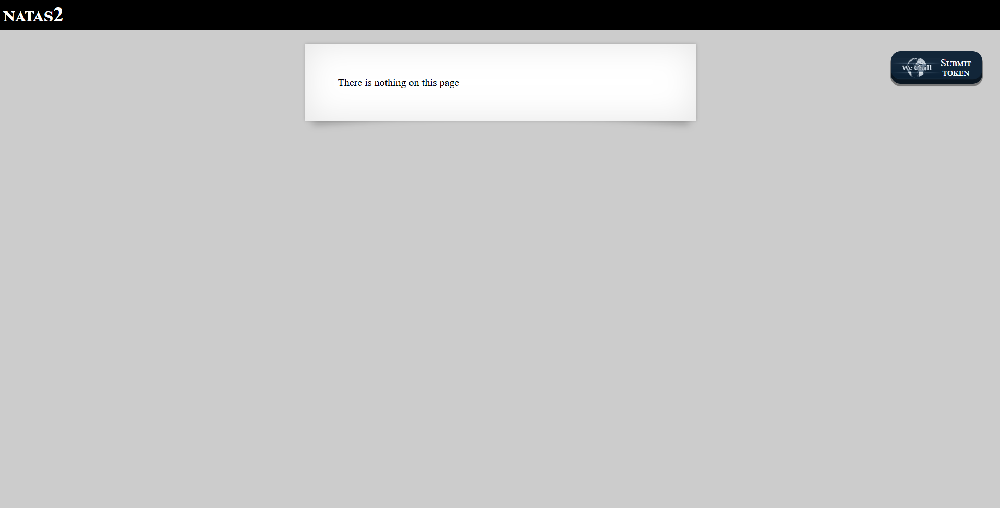
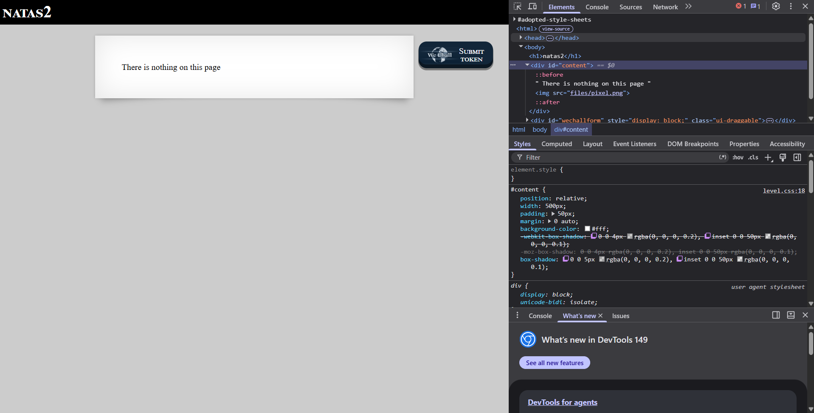
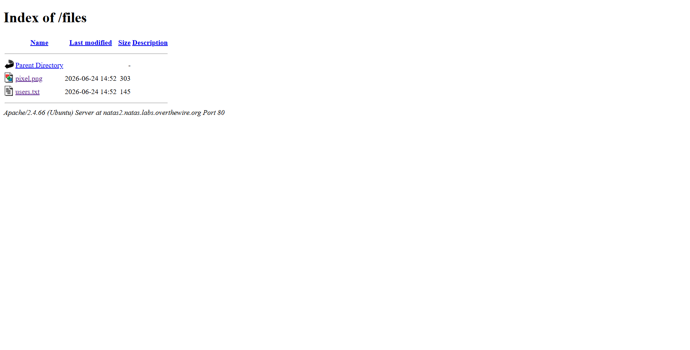

# Natas2 Walkthrough

## Challenges 
This one is bit tricky cause there is no more hint 

## Objective
We Have to find password

## What this level teach?
Everything is not in the webpage 

## How to do it ?
1.First login to natas 2 and get on the page 

2.Right click on that page 

3.Expand body and content

4.there is something called index.png but if you open it there is nothing just a pixel 

5.Observe what is before index.png you'll get it's a file 

6.Input that on the url

7.open users.txt

8.You'll get the solution congrates
